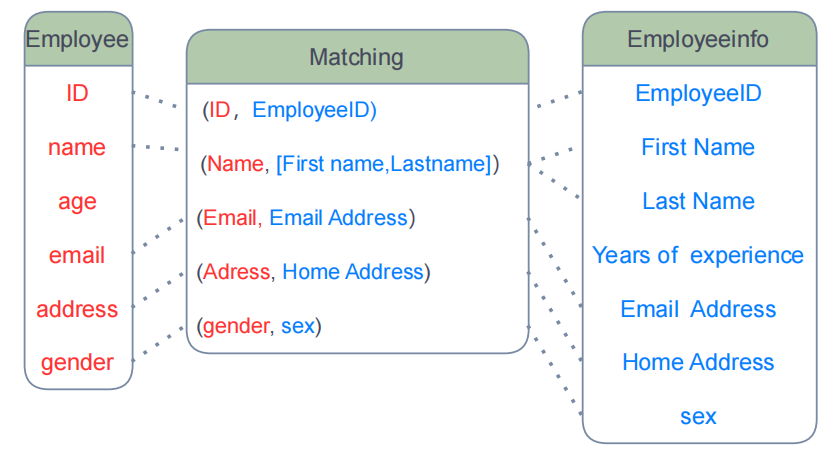
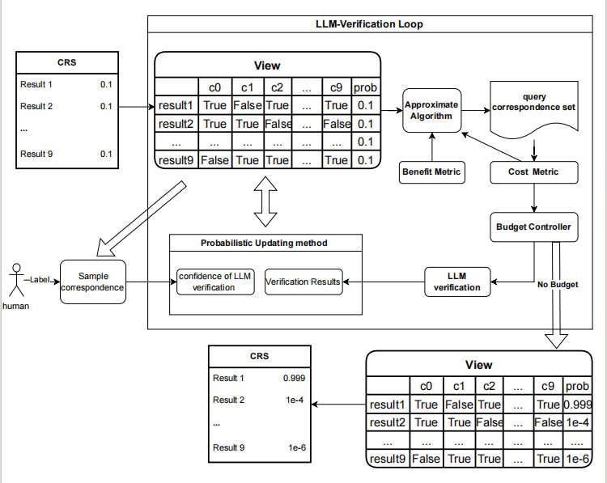

# LLM-matcher: An Algorithm To Improve The Data Quality Of Schema Matching Candidate Result Set

    

## 目录(Directory)
1. [介绍](#介绍(introduce))
2. [功能特点](#功能特点(function features)) 
3. [安装](#安装 installation) 
4. [使用](#使用 usage) 
5. [贡献](#贡献 contributions)         
6. [许可证](#许可证 license)

## 介绍

#### This is the experiment code project of paper “LLM-matcher: An Algorithm To Improve The Data Quality Of Schema Matching Candidate Result Set”
#### LLM-matcher is a latest idea for data integration and an excellent framework for improving the data integration of the candidate result set
#### LLM-matcher would help you a lot to make the schema matching task become very easy and automatic. For most cases, for example financial and laws 
#### users only need to evaluation an accuracy rate of the LLM, this process may only cost 5 minutes. After that LLM-matcher can run automatically in the whole process
#### To some extent, LLM-Matcher integrate all the current possible schema match tools results and help users to select the most effective one.

    

## 功能特点(Function features)

This is the code project with python3，numpy.

1.The use of LLM allows the input of multiple dimensions of information to do the validation of correspondence in schema match 

2.Avoid hallucination

3.Reduce the excessive cost of large models

#### 中文

1.利用LLM，允许输入多个维度的信息，来做schema match中 correspondence的验证的优点

2.避免幻觉影响

3.减轻大模型的过高成本

## 安装(installation)

1. git clone <repo_name>
2. install the package of pip: pip install valentine, pandas, tiktoken, matplotlib,  scikit-optimize

中文:
1. git clone 本项目 到到本地
2. 安装所需要环境包
pip install valentine, pandas, tiktoken, matplotlib,  scikit-optimize

## 使用(uasge)
1. 运行 possible_matchings_generate.ipynb 生成 candidate result set 数据
2. fact.py 为主数据类，
3. query.py 定义四种实验对比的correspondence selection 方法和答案族的期望熵的评估值的计算函数等，approximate algorithm， Genetic Algorithm, Random Selection, Brute Selection.
4. improve_tool.py 定义实验中所用的工具函数
5. experiment.py 为实验启动脚本， conduct_ex， add_ex 为两个实验所用函数。experiment.ipynb 为测试用途，project 中所有名称中带test的脚本为测试所用。
6. cost_compare.ipynb 和 paint.ipynb 为实验数据画图的脚本

## 联系方式(contact)
Email: fly_fenglongyu@outlook.com

## 许可证(license)
This project use Creative Commons license: https://creativecommons.org/licenses/by-nc/4.0/legalcode
Creative Commons 署名-非商业性使用 4.0 国际许可协议
除非另有说明，否则在以下情况下允许对此作品进行：
- 共享 — 在任何媒介以任何形式复制、发行本作品。
- 改编 — 对此作品进行改编。
只要你遵守以下条件：
- 署名 — 你必须给出适当的署名，提供指向许可协议的链接，以及表明是否有做出更改。你可以用任何合理的方式来署名，但是不得以任何方式暗示许可人为你或你的使用背书。
- 非商业性使用 — 你不得将此作品用于商业目的。
- 没有附加限制 — 你不得对法律明确允许的限制之外的任何权利行使任何限制。
详细信息请参阅 Creative Commons 署名-非商业性使用 4.0 国际许可协议的全文：https://creativecommons.org/licenses/by-nc/4.0/legalcode

